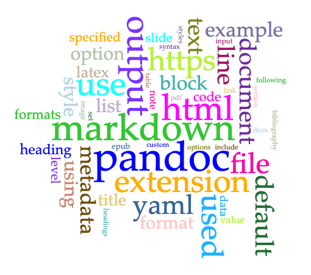

# Abstract

This is my abstract.

# Introduction

This is my introduction.

# Methodology

This is my Methodology.

## Data collection

Describe where the data come from.[^fn1]

## Processing Data and Tool use

# Results

This is my Results.

# Analysis

This is my analysis.

# Discussion

This is my discussion.

# Works Cited

This is my works cited.

# Notes

[^fn1]: See https://wikipedia.org.