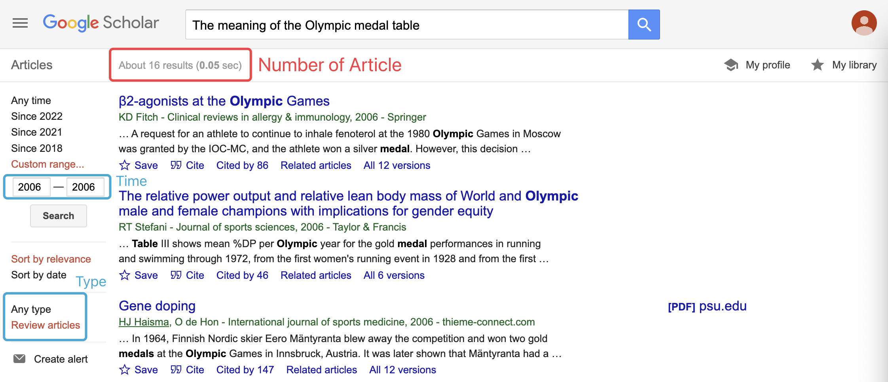
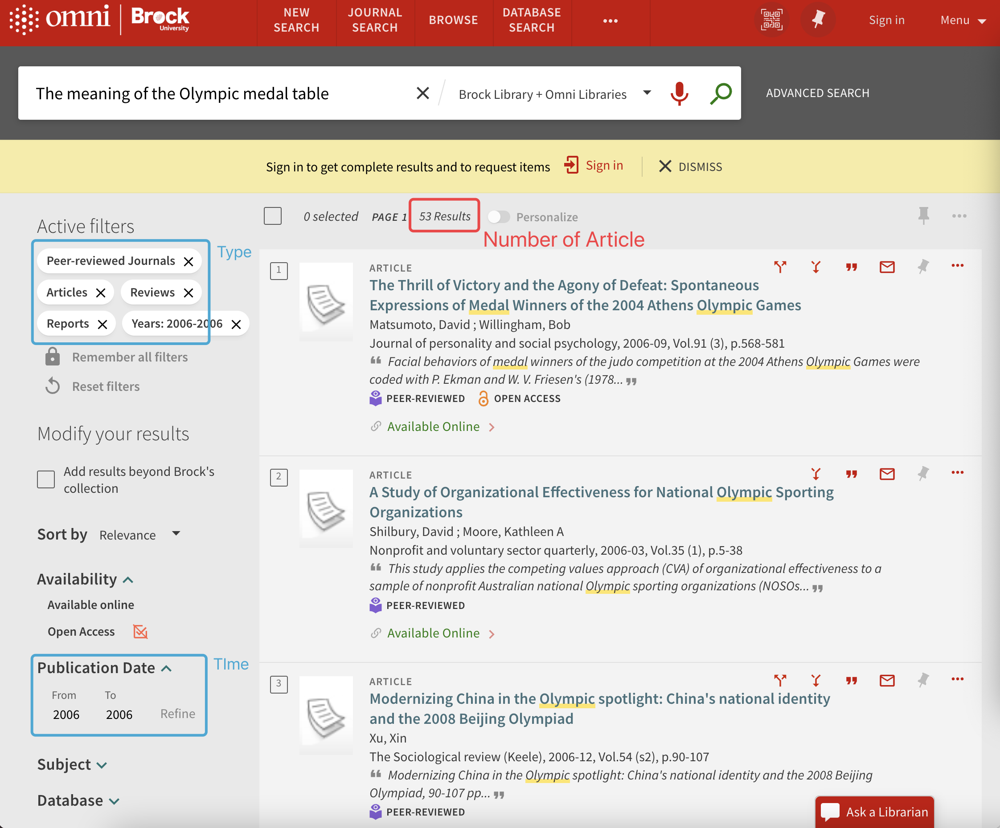
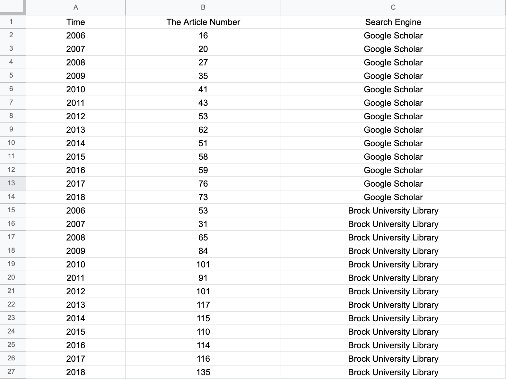
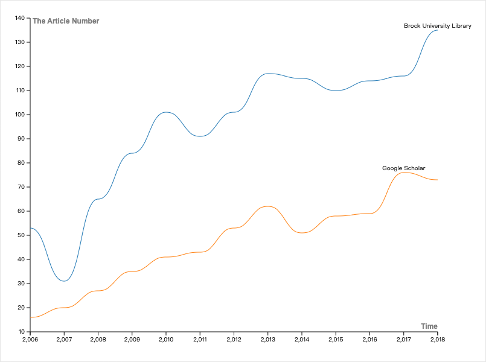
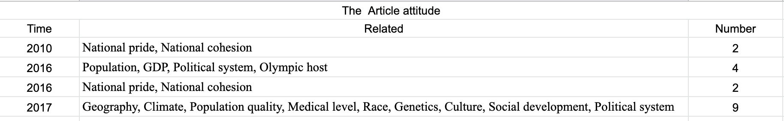
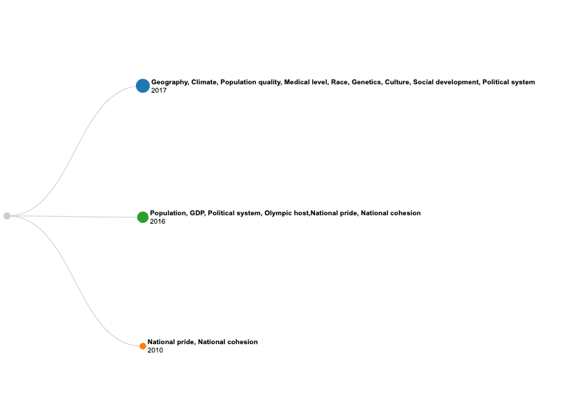

# Abstract

This report uses digital tools to research the Olympic medal tally issues. The course of the research shows how digital tools can help people understand information and develop critical thinking.

# Introduction

With the conclusion of the 2022 Beijing Winter Olympics at the Beijing National Gymnasium on February 20, the ranking of the medal standings will not change if countries can ensure the fairness of the competition, and it will be recorded in history. Is the medal count in the Olympics simply a leaderboard? What about the Olympic medal tally in the academic world? A widely accepted assumption is that it can reflect a country's comprehensive strength in the economy, scientific research, culture, education, and other aspects and can be used as a reference for national power ranking. This study will use digital tools to understand several academic papers and generate graphical results. Through the analysis of this result, I summarize the understanding of the Olympic medal table in the academic field and discuss the impact of an open and vibrant academic environment on the country's humanistic development.
# Methodology

* Researcher: Chen Xinyi
* Tools and materials: Google Academic, Brock Libraries, Voyant, Google Doc, Raw Graphs

## Data collection

* The search result of Google Scholar.[The Meaning of the Olympic Medal tally](https://ocul-bu.primo.exlibrisgroup.com/discovery/search?query=any,contains,The%20Meaning%20of%20the%20Olympic%20Medal%20tally&tab=OCULDiscoveryNetwork&search_scope=OCULDiscoveryNetwork&vid=01OCUL_BU:BU_DEFAULT&mfacet=tlevel,include,peer_reviewed,1&mfacet=rtype,include,articles,1&offset=0)
* The search result of Brock Library. [The Meaning of the Olympic Medal tally](https://scholar.google.com/scholar?q=The+meaning+of+the+Olympic+medal+table&hl=en&as_sdt=0%2C5&as_rr=1&as_ylo=2011&as_yhi=2011)

## Processing Data and Tool use
1. Use Google Scholar and Brock Library to search for articles related to "The Meaning of the Olympic Medal tally."
2. Determine search criteria for articles.
   1. Article Category. The researchers used filters to control the articles' tags to "Academic Journal" and "Peer Review," which ensured that the source of the research information was the academic community. I do not rule out that the articles in newspapers also have some academic significance. However, as information is published in the public media, most opinion support is provided by general knowledge. I cannot judge whether each public perception is academically supported by evidence and therefore cannot be sure of the objectivity of its views. Academics are more disciplined and more objective. Choosing to study it is more informative.
   2. Limit the number of articles by year, and the time limit is 2006-2018 (three Olympic cycles).
   
   Researchers have not collected relevant evidence to show that this has a positive impact on the country's human development. The author's point of view is that if a field has a high degree of attention, its development potential is higher.

3. Count the number of articles related to entries in different academic search engines.
   1.  Use Google doc to create tables to summarize research findings. 
       * Google Scholar Example of Data collection
         

       * Google Scholar Example of Data collection
         

   2.  Use "Raw Graphs" to visualize article count information. The picture results can help analyze the enthusiasm of the academic field for researching the Olympic medal table.
4. Focus on research related articles.
   1. The number of articles is selected as 5. The small volume of information was chosen because of the limited space of the research report and the purpose of the research report.
   2. Conduct research in accordance with published timelines.
   3. Use Voyant to skim the article. Analyze the following information for the article.
      * Judging the usability of an article: Take a cursory look at whether research results support it.
      * Article attitude:
        * Cirrus: shows lexical frequencies, which can be used to get the main point.
        * Link: shows the relationship between high frequency words used
        * Madala: shows the relationship between terms and documents
        * Dream Space: showcases key regions for article research
        * Readers: read the entire article and learn more about the research ideas of the article.

5. Use Google doc to create a table summarizing the research results of the No.4 step.

# Results
Get pictures of visual information

## For Step 3
* Google Doc: 
  

* Raw Graphs: 
  

## For step 4:
* Voyant Resources:
  1. _“How to Influence National Pride? The Olympic Medal Index as a Unifying Narrative.” (Ivo van Hilvoorde, I.M, A Elling, and R Stokvis., 2010)
 
      [Voyant Result of this article](https://voyant-tools.org/?corpus=43be26d9236aa33de3f1fce8fa1b05ef&panels=cirrus,collocatesgraph,mandala,reader,dreamscape)
      * Medals are linked to national pride and national cohesion. The state has invested in some elite sports for the sake of the national identity of the people. These investments will have a positive impact on the country's economic growth.
      * Region: USA, Europe, China.

  2.  _“Olympic Medals: Does the Past Predict the Future?” (Bredtmann, Julia, Carsten J Crede, and Sebastian Otten., 2016)_     
      [Voyant Result of this article](https://voyant-tools.org/?corpus=893ada760eae65671a8e6049d1b10f4f&panels=cirrus,collocatesgraph,mandala,reader,dreamscape)
      * Medals are related to the country's population, GDP, political system, whether it is an Olympic host or not. Population determines the amount of potential talent in a sport. GDP determines the country's ability to develop sports-related leisure activities, train professional athletes, and build sports infrastructure.
      * Region: London.

  3.  _“Rio Olympics 2016: How Medal Count Mirrors Shape of Global Economy.” (Emily Cadman., 2016)_   
      [Voyant Result of this article](https://voyant-tools.org/?corpus=b3c9b61989a23738bd59a0baf075c295&panels=cirrus,collocatesgraph,mandala,reader,dreamscape)
      * No availability, lack of support from research results.
       
  4.  _“Nothing but Medals? Attitudes Towards the Importance of Olympic Success.” (Haut, Jan, Robert Prohl, and Eike Emrich., 2016)_     
      [Voyant Result of this article](https://voyant-tools.org/?corpus=7ac680300c5fe42896a13eecc4be246b&panels=cirrus,collocatesgraph,mandala,reader,dreamscape)
      * Medals are associated with national pride and national cohesion.
      * Region: USA, Europe, Asia.
  5.  _“Population Muscle Strength Predicts Olympic Medal Tallies: Evidence from 20 Countries in the PURE Prospective Cohort Study.” (Leong, Darryl P, Martin McKee, and Salim Yusuf., 2017)_     
      [Voyant Result of this article](https://voyant-tools.org/?corpus=e674d35051c05a58bca0043c6060bf64&panels=cirrus,collocatesgraph,mandala,reader,dreamscape )
      * Medals are related to the country's geography, climate, population quality, medical level, race, genetics, culture, social development, and political system. Geographical and climatic conditions in a country can influence the frequency of exposure to certain types of sports. For example, colder countries are better at ice and snow sports, and they will excel in the Winter Olympics. Population quality emphasises the health of the human body. In countries with high medical level, people's physical quality is high, and the limit of physical function is also high.
      * Region: USA, Europe, China, Dubai.
   
* Google Doc:
 

* Raw Graphs:
  

# Analysis

1. The researcher conducts a horizontal and vertical comparative analysis of the pictures, and summarizes the main findings.
2. There has been an overall upward trend in academic activity in exploring the meaning of the Olympic medal tally.
3. The number of areas of expertise that the academic field includes when analyzing factors associated with medal tallies increases year by year. The depth and breadth of research are also increasing.

# Discussion

1. Discussion of visualization tools. 
   
   I think the essence of digital tools is to present textual data so that more people are interested and able to understand. Information in plain text is complex and time-consuming to process, and is an inefficient medium. Visualization tools use human abilities—empowering objects, understanding short texts, conceptual models and basic mappings (The Design of everyday things) generated in exploring the world—to help people process information efficiently.

   Efficiency here refers to
   1. It compresses the size of the information on the premise of ensuring the complexity of the information (such as comparability).
   2. Improve the flow of information.
   3. Compared with non-visualized text information, people's understanding speed and memory ability of images will be higher.
   4. To ensure the creativity of readers' thinking while providing information. Realize the interaction of information.
   
   Visualization tools are for ordinary people, translators between professional knowledge and public knowledge, and summarize and package information at the same time.
2. Limitations of the method.
   
   This research report does not rule out the influence of attitudes towards Open access in the academic community on positivity. As [Peter Suber (2004)](https://lms.brocku.ca/access/content/group/4311b671-abea-4ec2-b262-2b6d5c46e37b/Peter%20Suber%2C%20Open%20Access%20Overview%20_definition%2C%20introduction_.pdf) thought, open access eliminates many access barriers. The development of digital technology has digitized some offline information, helping knowledge to break away from geographical restrictions. Offline/digital academic information repositories open to the public increase the flow of information in the public domain. Whether academia's enthusiasm for the Olympic medal tally will increase due to these events is beyond the scope of this article.

   The constraints of information visualization tools, such as cultural constraints, are also outside the scope of the discussion.

# Works Cited

1. Bredtmann, Julia, Carsten J Crede, and Sebastian Otten. “Olympic Medals: Does the Past Predict the Future?” Significance (Oxford, England) 13.3 (2016): 22–25. Web.
2. Emily Cadman. “Rio Olympics 2016: How Medal Count Mirrors Shape of Global Economy.” FT.com (2016): n. pag. Print.
3. Haut, Jan, Robert Prohl, and Eike Emrich. “Nothing but Medals? Attitudes Towards the Importance of Olympic Success.” International review for the sociology of sport 51.3 (2016): 332–348. Web.
4. Leong, Darryl P, Martin McKee, and Salim Yusuf. “Population Muscle Strength Predicts Olympic Medal Tallies: Evidence from 20 Countries in the PURE Prospective Cohort Study.” PloS one 12.1 (2017): e0169821–e0169821. Web.
5. Ivo van Hilvoorde, I.M, A Elling, and R Stokvis. “How to Influence National Pride? The Olympic Medal Index as a Unifying Narrative.” International review for the sociology of sport 45.1 (2010): 87–102. Web.

# Notes
I do not think my research questions and assumptions are rigorous, and apart from the drawbacks presented at the end of the report, many things have not been considered. The purpose of this report is not the topic itself. What is important is presenting the research ideas and using various tools for digital information. The report itself also contains some personal thoughts. I try to be objective, but there seems to be no way out of the subjective frame. Maybe we can find the most objective answer after summarizing various subjective thoughts of human beings. The world is forever relative.
